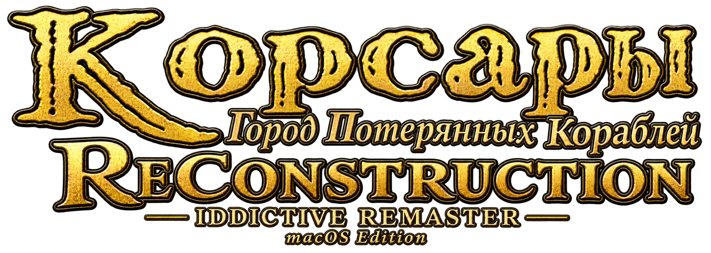
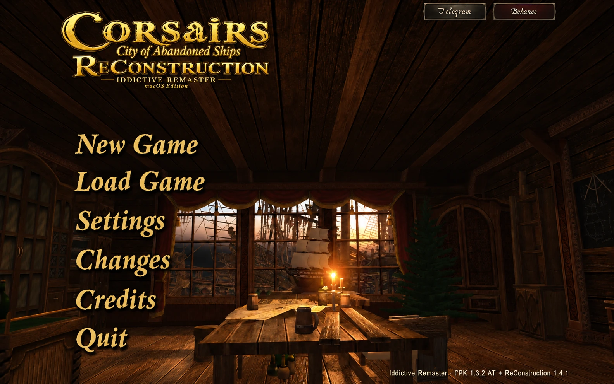
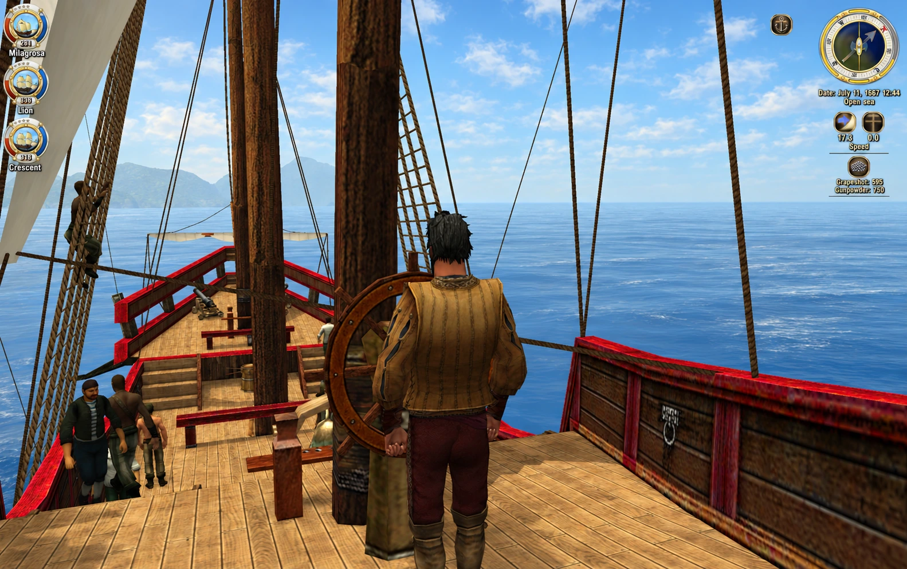

<p align="center">
  
</p>

<h1 align="center">Corsairs · Iddictive Remaster</h1>

<p align="center">Sail, fight and trade in City of Abandoned Ships, running natively on Apple Silicon through Metal.</p>

<p align="center">
  <a href="https://drive.google.com/drive/folders/1JDiOAg3S3OgKAATjjA7TZfIHW39u2Wi8">Download for macOS</a> ·
  <a href="#quick-start">Quick start</a> ·
  <a href="#downloads">Downloads</a> ·
  <a href="CHANGELOG.md">Changelog</a> ·
  <a href="https://iddictive.us/cases/corsairs-native-metal/">Project case</a> ·
  <a href="#russian">Русский</a>
</p>

<p align="center">
  <a href="https://github.com/iddictive/Corsairs-Remaster/releases/tag/experimental-metal"></a>
  
  
</p>

A native Mac version of GPK 1.3.2 AT + ReConstruction 1.4.1, with a Metal renderer, gameplay patches and a self-contained app. The engine, Python and runtime libraries are bundled; playing does not require Wine, CrossOver, Xcode or Homebrew.

<p align="center">
  <a href="docs/images/main-menu.webp"></a>
</p>

*English promotional edit of the player’s menu capture. The game interface remains Russian.*

## Quick start

1. Download `Corsairs-Iddictive-Remaster-macOS.zip` from [Google Drive](https://drive.google.com/drive/folders/1JDiOAg3S3OgKAATjjA7TZfIHW39u2Wi8).
2. Extract it and move **Corsairs Iddictive Remaster.app** to Applications.
3. Open the app and play.

Requires Apple Silicon and macOS 15 or newer. Saves and settings live separately in `~/Library/Application Support/Iddictive Corsairs`; replacing the app preserves your progress.

## Features

- Native Metal rendering, lighting and shadows, weather-driven sea and sky.
- FXAA, texture delivery corrections and GPU skinning.
- Walking on your ship’s deck, with ship motion and deck contact.
- Crime, reputation, surrender and custody changes.
- Shared squad supplies and cabin officer equipment adapters.
- Progression balancing and per-hit firearm damage limits.
- Consistent trade-journal units, a revised main menu and external player state.

<p align="center">
  <a href="docs/images/on-deck.webp"></a>
</p>

*English promotional edit of the player’s deck capture. The [case study](https://iddictive.us/cases/corsairs-native-metal/) explains the renderer and gameplay changes.*

## Downloads

| Package | Use it for | Where to get it |
| --- | --- | --- |
| macOS app | Playing; engine, game data and runtime libraries included | [Google Drive folder](https://drive.google.com/drive/folders/1JDiOAg3S3OgKAATjjA7TZfIHW39u2Wi8) |
| Pinned build inputs | Building from source; engine source, headers, tools and reviewed originals | [Experimental release](https://github.com/iddictive/Corsairs-Remaster/releases/tag/experimental-metal) |
| Source checkout | Editing the renderer, launchers and reviewed gameplay adapters | [This repository](https://github.com/iddictive/Corsairs-Remaster) |

The app ZIP is 11,298,197,161 bytes. The smaller build-input archive is not the full game download.

## Build from source

Requires Apple Silicon, macOS 15+, Xcode command-line tools and Python 3.10+. Install the downloadable app first: it supplies game assets for local development staging.

```sh
git clone https://github.com/iddictive/Corsairs-Remaster.git
cd Corsairs-Remaster
curl -fL -o build-inputs.tar.gz \
  https://github.com/iddictive/Corsairs-Remaster/releases/download/experimental-metal/Corsairs-Metal-build-inputs.tar.gz
tar -xzf build-inputs.tar.gz -C experiments/native-metal
python3 tools/prepare_metal_inputs.py --check
experiments/native-metal/run.sh --stage-only
experiments/native-metal/run.sh --launch-installed
```

The input archive pins engine source, headers, dependencies, tools and reviewed originals. Its SHA-256 is `2e7f68269941db86aef14a4130a91054c59ac473b34119333df30f4efbd877a8`. It is not the full game download.

Development staging has separate saves and never imports or overwrites the installed app’s saves. [Development instructions](docs/DEVELOPMENT.md) explain the owners, staging and packaging commands.

## Requirements and current status

- Apple Silicon Mac and macOS 15 or newer; Intel Macs are unsupported.
- Game interface: Russian.
- Experimental build: the player has reached the menu, sea, deck and prison scenes; wider gameplay and testing on other Macs remain open.
- App and nested dependencies are ad-hoc signed; the package is not notarized.

Restart after a resolution change if borders or incomplete interface graphics appear. The original unsigned package stalled during CoreAudio/TCC startup; the native launcher and complete bundle signature corrected the observed packaging defect in the subsequent player replay.

## Attribution

`experiments/native-metal` is the supported runtime. `experiments/native-storm` retains source adapters required by the build; its old runtime is unsupported. Original engine source and dependency notices are included in the pinned inputs. This repository does not grant ownership of third-party game content.

---

<a id="russian"></a>

## Русский

«Корсары: Город потерянных кораблей» для Apple Silicon с нативным Metal-рендерером, на базе ГПК 1.3.2 AT + ReConstruction 1.4.1. В приложении уже есть движок, Python и необходимые библиотеки: для игры не нужны Wine, CrossOver, Xcode или Homebrew.

### Установка

1. Скачайте `Corsairs-Iddictive-Remaster-macOS.zip` из [папки Google Drive](https://drive.google.com/drive/folders/1JDiOAg3S3OgKAATjjA7TZfIHW39u2Wi8).
2. Распакуйте архив и перенесите приложение в Applications.
3. Запустите игру.

Нужны Apple Silicon и macOS 15 или новее. Интерфейс игры остаётся русским; англоязычные иллюстрации в README подготовлены для презентации проекта. Сохранения и настройки хранятся отдельно от приложения и переживают его замену.

### Что изменено

Нативный рендерер, свет, тени, море и небо, сглаживание FXAA, загрузка текстур и GPU skinning; прогулки по палубе, преступления и репутация, сдача и заключение, снабжение отряда и офицеров, развитие навыков, ограничения урона огнестрела и торговый журнал.

Сборка экспериментальная: запуск, море, палуба и тюрьма проверены игроком, остальные сценарии и совместимость с другими Mac продолжаем проверять. После смены разрешения перезапустите игру, если появились рамки или неполный интерфейс.

### Разработка

Команды сборки приведены в [Build from source](#build-from-source), порядок работы — в [docs/DEVELOPMENT.md](docs/DEVELOPMENT.md). Полная игра скачивается с Drive; архив входных данных для сборки — из [Releases](https://github.com/iddictive/Corsairs-Remaster/releases/tag/experimental-metal).

[История изменений](CHANGELOG.md) · [Статья со скриншотами](https://iddictive.us/cases/corsairs-native-metal/)
